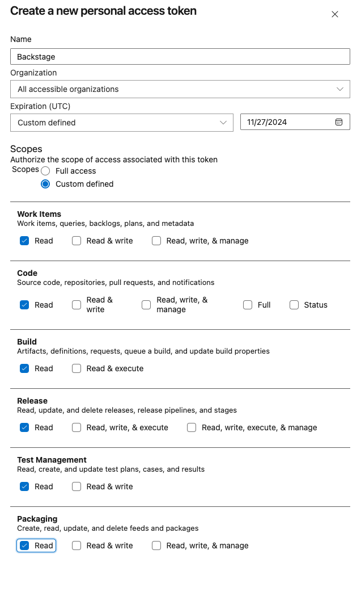
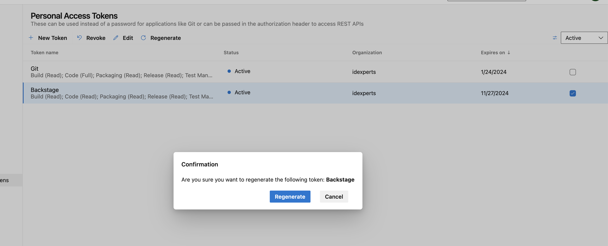

# Generating an Azure DevOps Personal Access Token (PAT)

## Creating a new PAT

1. Login to Azure DevOps. Go to User Settings -> Security -> Personal Access Tokens.
   Or go directly to this URL: https://idexperts.visualstudio.com/_usersSettings/tokens

2. Click **Create new Token**.

3. Fill out all of the required fields. See this image for an example:
   
   

   1. The name should be **Backstage** so it can be easily identified
   2. Select **All accessible organizations**.
   3. The expiration date should be 1 year into the future (or choose the maximum TTL you can specify). 
   4. Select all **Read** checkboxes. This will give Backstage enough permissions to read catalog information.

4. Save the token in Lastpass (stored under **Backstage - Azure DevOps PAT**).

5. Save the token in Vault. Remember to do this for each env.
   1. You can update Vault via the UI.
   
   2. Or the CLI:

    ```
    # authenticate to vault (your user must be able to edit `secret/backstage` path)
    # follow best practices for asking for permissions if you do not have access
    export $(vt vault login -env=qa --echo)

    # if there is other data besides "access_token" here - make sure they are written back in the `put` statement below!
    vault kv get secret/backstage/azure
    vault kv put secret/backstage/azure access_token="TOKEN"
    ```

6. Repeat Vault upload for each env.

## Regenerate a new PAT 

1. Login to Azure DevOps. Go to User Settings -> Security -> Personal Access Tokens.
   Or go directly to this URL: https://idexperts.visualstudio.com/_usersSettings/tokens

2. Click the checkbox next to the **Backstage** token. Then select **Regenerate**.

3. Select yes for the next prompt.

    

4. Save the token in Lastpass (stored under **Backstage - Azure DevOps PAT**).

5. Save the token in Vault. Remember to do this for each env.
   1. You can update Vault via the UI.
   
   2. Or the CLI:

    ```
    # authenticate to vault (your user must be able to edit `secret/backstage` path)
    # follow best practices for asking for permissions if you do not have access
    export $(vt vault login -env=qa --echo)

    # if there is other data besides "access_token" here - make sure they are written back in the `put` statement below!
    vault kv get secret/backstage/azure
    vault kv put secret/backstage/azure access_token="TOKEN"
    ```

6. Repeat Vault upload for each env.